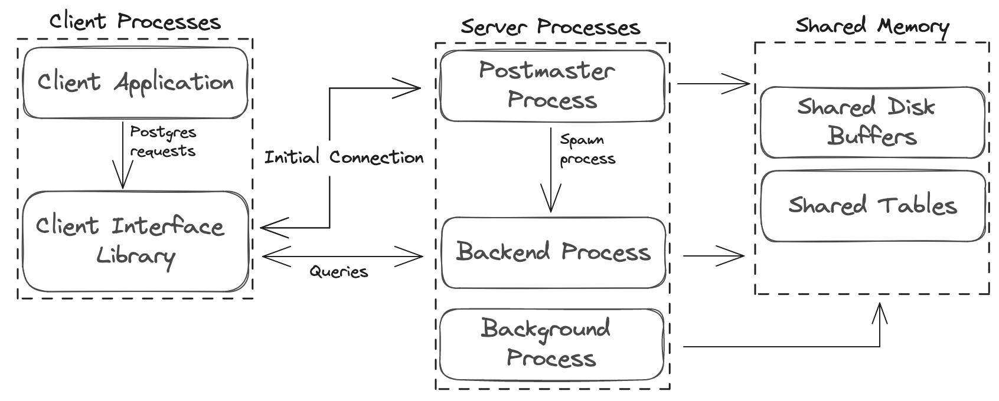

# Process Architecture

Postgres uses a multi-process architecture for handling [client connections](https://www.postgresql.org/docs/current/connect-estab.html) and queries. Understanding the PostgreSQL process model can help you optimize resource usage and troubleshoot performance issues.

## Process Types

- **Postmaster Process**: The postmaster or server process is the main process that manages the Postgres server. It listens for incoming connections from clients and spawns new backend processes to handle client requests.
- **Backend Processes**: Backend processes are responsible for handling client queries and managing database operations on their behalf. Each backend process is associated with a single client connection.
- **Background Processes**: Background processes are used for performing maintenance tasks and background operations. Some examples would be the `Checkpointer` which flushes dirty data from memory to disk, the `WalWriter` which writes WAL data to disk, and the `Autovacuum Launcher` which performs automatic vacuum and analyze operations to maintain database health.

  

Postgres will maintain a pool of backend processes that can be assigned to a client when a new connection is established. If there are no available backend processes in the pool, the postmaster will spawn a new backend process to handle the connection.

This architecture allows Postgres to handle multiple client connections concurrently and provides a dedicated and isolated virtual memory space for each client connection. The process oriented architecture can create overhead when dealing with a large number of client connections however, and CPU exhaustion for clients can happen when the number of client connections exceeds the number of available CPU cores.

## Memory Architecture

Postgres uses a shared memory architecture to manage memory across processes.

- **Shared Buffers**: The shared buffer is a portion of memory used to cache data pages from disk. It helps reduce the need for disk I/O by keeping frequently accessed data in memory.
- **WAL Buffer**: The Write-Ahead Log (WAL) buffer is used to store WAL records before they are written to disk and helps ensure that changes are durable.
- **Local Process Memory**: Each backend process has its own local memory space for storing query plans, intermediate results, and other per-process data.

[Introduction](../README.md) | [Write-Ahead Logging](2_wal.md)
