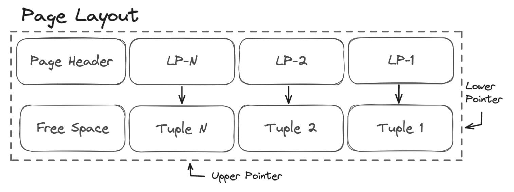

# Heap Storage

When you insert or update rows in a table, PostgreSQL stores the data in segment or heap files which are physical files on disk that store a portion of a tables data. You can find the implementation for many of the heap access routines in [heapam.c](https://github.com/postgres/postgres/blob/master/src/backend/access/heap/heapam.c).

Each segment file is further divided into fixed-size pages, which are the smallest unit of storage in Postgres. Each page typically stores multiple tuples, and the layout of a page in a segment file can be seen in the diagram below.



The [page header](https://github.com/postgres/postgres/blob/master/src/include/storage/bufpage.h) contains metadata about the page such as the page checksum, pointers to the upper and lower tuples, and the total number of tuples stored.

```C
typedef struct PageHeaderData
{
/* XXX LSN is member of *any* block, not only page-organized ones */
  PageXLogRecPtr  pd_lsn;       /* LSN: next byte after last byte of xlog
                                * record for last change to this page */
  uint16          pd_checksum;  /* checksum */
  uint16          pd_flags;     /* flag bits, see below */
  LocationIndex   pd_lower;     /* offset to start of free space */
  LocationIndex   pd_upper;     /* offset to end of free space */
  LocationIndex   pd_special;   /* offset to start of special space */
  uint16          pd_pagesize_version;
  TransactionId   pd_prune_xid; /* oldest prunable XID, or zero if none */
  ItemIdData      pd_linp[FLEXIBLE_ARRAY_MEMBER]; /* line pointer array */
} PageHeaderData;
```

The [line pointer](https://github.com/postgres/postgres/blob/master/src/include/storage/itemid.h) (LP) array contains pointers to the tuples stored on the page. Each LP entry consists of an offset to the start of the tuple, the length of the tuple, and a flag indicating the state of the tuple.

```C
typedef struct ItemIdData
{
    unsigned    lp_off:15,      /* offset to tuple (from start of page) */
                lp_flags:2,     /* state of line pointer, see below */
                lp_len:15;      /* byte length of tuple */
} ItemIdData;
```

Every tuple will consist of a tuple header and the actual tuple data. The tuple header contains metadata about the tuple such as the length of the tuple, the tuple type, and the Command Tuple ID (CTID).

- Talk about immutable tuples and how they are stored in the heap
- Talk about updates, heap only tuple (HOT) updates
- Fill factor and how it affects the number of tuples stored on a page
- Talk about tuple visibility and deletion
- Talk about vacuuming and freezing tuples

[Process Architecture](1_process_architecture.md) | [Write-Ahead Logging](3_wal.md)
