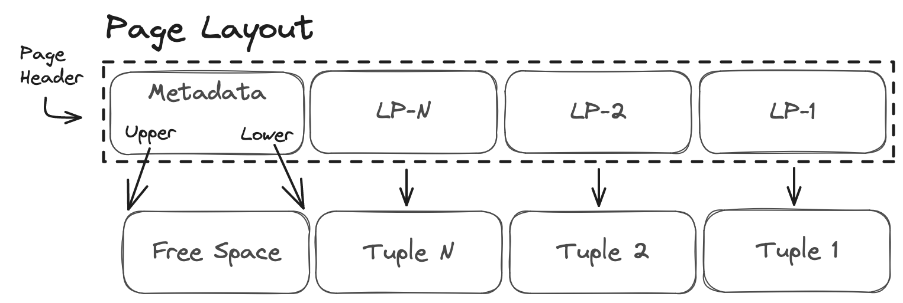

# Heap Storage

When you insert or update rows in a table, PostgreSQL stores the data in segment or heap files which are physical files on disk that store a portion of a tables data. You can find the implementation for many of the heap access routines in [heapam.c](https://github.com/postgres/postgres/blob/master/src/backend/access/heap/heapam.c).

Each segment file is further divided into fixed-size pages, which are the smallest unit of storage in Postgres. Each page typically stores multiple tuples, which are identified by a unique tuple identifier (CTID) which is a [system column](https://www.postgresql.org/docs/current/ddl-system-columns.html) that consists of the page number and the tuple index on the page. The layout of a page in a heap data file can be seen in the diagram below.

<p align="center">
  
</p>

The [page header](https://github.com/postgres/postgres/blob/master/src/include/storage/bufpage.h) contains metadata about the page such as the page checksum, pointers to the upper and lower tuples, and the total number of tuples stored.

```C
typedef struct PageHeaderData
{
/* XXX LSN is member of *any* block, not only page-organized ones */
  PageXLogRecPtr  pd_lsn;       /* LSN: next byte after last byte of xlog
                                * record for last change to this page */
  uint16          pd_checksum;  /* checksum */
  uint16          pd_flags;     /* flag bits, see below */
  LocationIndex   pd_lower;     /* offset to start of free space */
  LocationIndex   pd_upper;     /* offset to end of free space */
  LocationIndex   pd_special;   /* offset to start of special space */
  uint16          pd_pagesize_version;
  TransactionId   pd_prune_xid; /* oldest prunable XID, or zero if none */
  ItemIdData      pd_linp[FLEXIBLE_ARRAY_MEMBER]; /* line pointer array */
} PageHeaderData;
```

The line pointer (LP) array contains [pointers](https://github.com/postgres/postgres/blob/master/src/include/storage/itemid.h) to the tuples stored on the page. Indexes will store the CTID of the tuple in the index, which contains the page number and the tuple index in the line pointer array on the page. Each line pointer entry consists of an offset to the start of the tuple, the length of the tuple, and a flag indicating the state of the tuple.

```C
typedef struct ItemIdData
{
    unsigned    lp_off:15,      /* offset to tuple (from start of page) */
                lp_flags:2,     /* state of line pointer, see below */
                lp_len:15;      /* byte length of tuple */
} ItemIdData;
```

Tuples are considered immutable once they are inserted into a page. When you update a tuple, the database does not modify the existing tuple in place. Instead, Postgres creates a new version of the tuple with the updated values and marks the old tuple as `dead` or `unused`. When possible the new tuple is inserted into the same page where the old tuple was located, and the old tuple is eventually reclaimed by the autovacuum process.

If a new tuple is stored on the same page as the old tuple, and no indexed columns have been updated Postgres performs a [Heap-Only Tuple (HOT)](https://www.postgresql.org/docs/current/storage-hot.html) update. HOT updates are more efficient than regular updates because they avoid the need to update all indexes that reference the old tuple, instead they only need to update the line pointer array for the page to redirect queries to the new tuple.

The fill factor for a table determines how much space Postgres will leave on each page for insertions or updates. When you insert a new tuple into a page, Postgres will first check if there is enough space to store the tuple. If there is not enough space, Postgres will perform a page split and move some of the tuples to a new page. Tuning the fill factor value can help reduce the likelihood of page splits and fragmentation or increase the likelihood of a HOT update occurring. The downside of setting a lower fill factor is that it will increase the number of pages required to store the same number of tuples, increasing storage costs and the IO required for sequential scans.

[Write-Ahead Logging](2_wal.md) | [Introduction](../README.md) | [Query Parser](4_query_parser.md)
