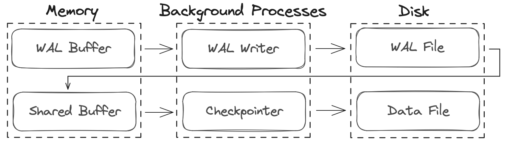

# Write-Ahead Logging (WAL)

[Write-Ahead Logging (WAL)](https://www.postgresql.org/docs/current/wal-internals.html) is a key feature of Postgres that ensures durability and data integrity by writing changes to the database to a log before applying them to the actual data files. This mechanism provides several benefits, including crash recovery, replication, and efficient use of disk I/O.

## WAL Files and Log Sequence Numbers (LSN)

The WAL records are stored in a series of segments, called WAL files. These records contain the details necessary to describe the changes made to the database. Each WAL file is a fixed size, typically 16MB, and is written sequentially to disk. When a WAL file is full, Postgres switches to a new WAL file and continues writing new records.

Each WAL record is identified by a Log Sequence Number (LSN). The LSN is stored in the page header of each data page, and is used to track the progress of replication or crash recovery, as well as ensuring that changes are applied in the correct order.

## Checkpoints and Replication

When a client backend process writes a change to the database, the change is first written to the WAL buffer in memory. Any shared buffers that are impacted by that change are also marked as dirty. Periodically, the shared buffers are flushed to disk, and the changes are written to the data file. This process is called a `checkpoint`.

TODO:

- Explain how WAL is used in replication
- Explain checkpointer process

[Heap Storage](2_heap_storage.md) | [Introduction](../README.md) | [Query Parser](4_query_parser.md)
