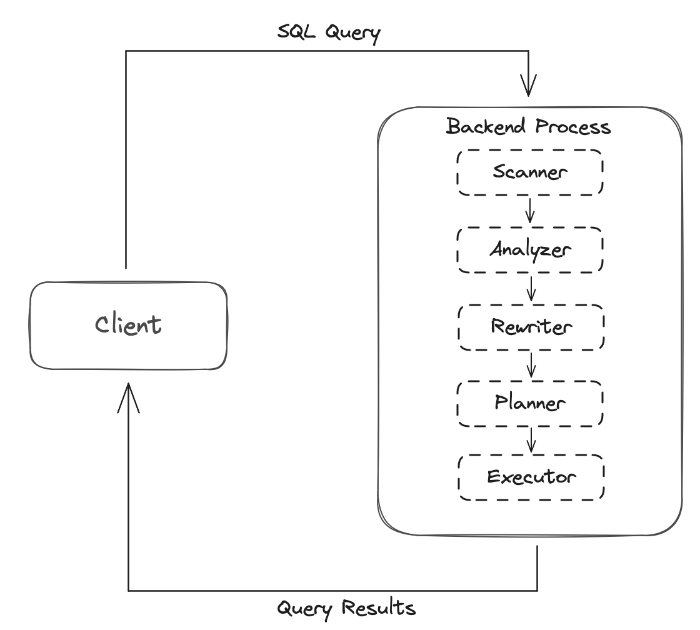
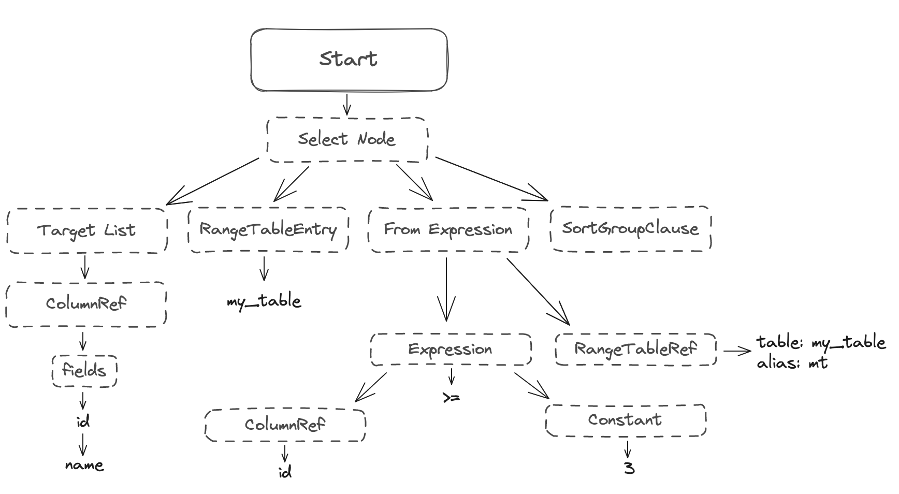

# Query Parser

The [Query Parser](https://www.postgresql.org/docs/current/parser-stage.html) is responsible for parsing SQL queries, interpreting their structure, and generating an internal representation of the query that can be executed by the query planner and executor. The Query Parser is implemented using a tool called [Yet Another Compiler-Compiler (YACC)](https://en.wikipedia.org/wiki/Yacc) to generate a parser from a grammar specification.

  

The query parser will first perform lexical analysis, also known as tokenization, where it breaks down the input SQL query into a sequence of tokens such as keywords, identifiers, literals, and operators. You can find the scanner implementing in the [scan.l](https://github.com/postgres/postgres/blob/master/src/backend/parser/scan.l) file.

Next, the parser performs syntax analysis, also known as parsing, where it checks the sequence of tokens against the rules of the SQL grammar defined in [gram.y](https://github.com/postgres/postgres/blob/master/src/backend/parser/gram.y) to ensure that the query is syntactically correct. If the query contains any syntax errors, the parser will report them to the user.

After the query is parsed, the parser performs semantic analysis, where it checks the query for semantic errors such as referencing non-existent tables or columns, ambiguous column references, and type mismatches. The parser also resolves any aliases or qualified names used in the query.

Once the query has been successfully parsed and analyzed, the parser generates an abstract syntax tree (AST) known as the query tree or parse tree. This query tree is a hierarchical structure that represents the logical structure of the query and is used by the query planner and executor to generate an execution plan.

  

In addition to parsing and analyzing queries, the query parser in Postgres also performs query rewriting and optimization. This includes tasks such as:

- Predicate Pushdown: Pushing filter predicates down to the lowest possible level in the query tree to reduce the amount of data that needs to be processed.
- Join Order Optimization: Optimizing the order in which tables are joined to minimize the number of join operations and improve query performance.
- Subquery Optimization: Rewriting subqueries to improve performance by reducing the number of times they need to be evaluated.

[Write-Ahead Logging](3_wal.md) | [Introduction](../README.md) | [Query Optimization](5_query_optimization.md)
